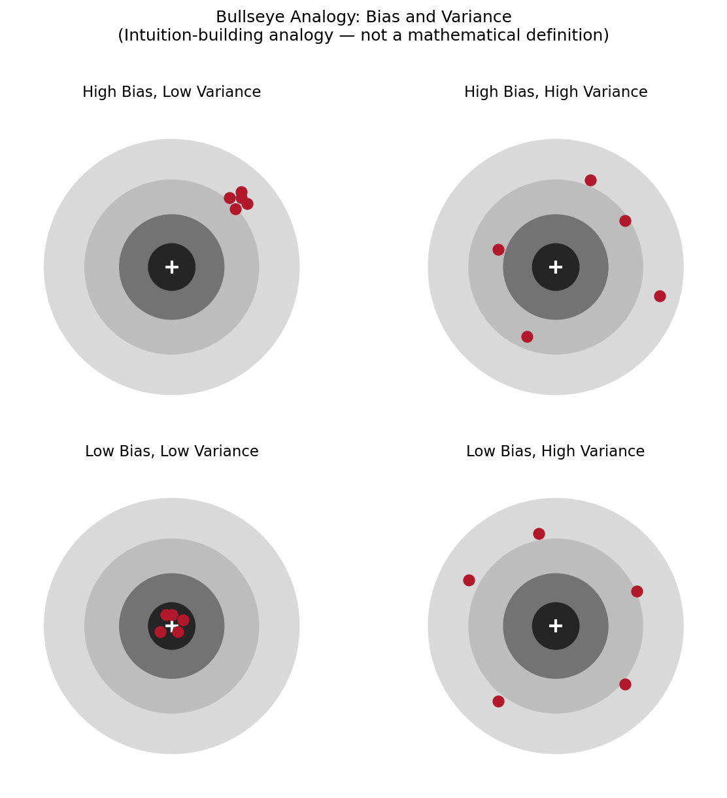
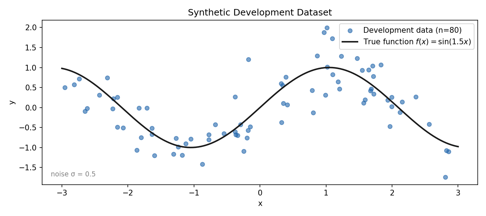
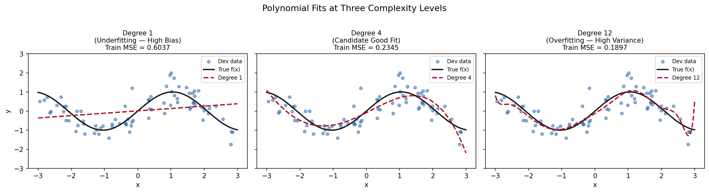
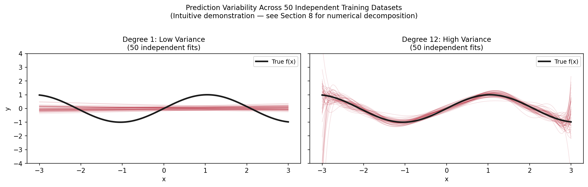
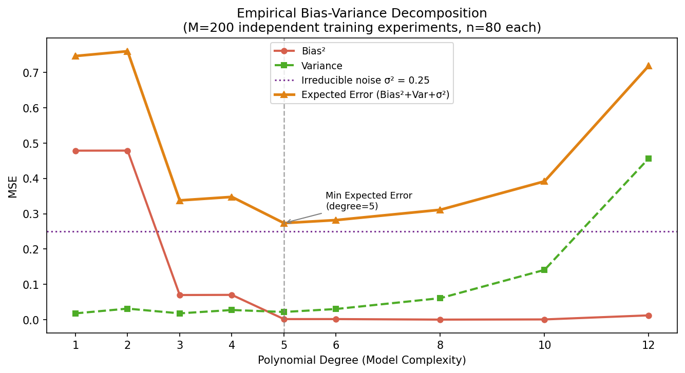
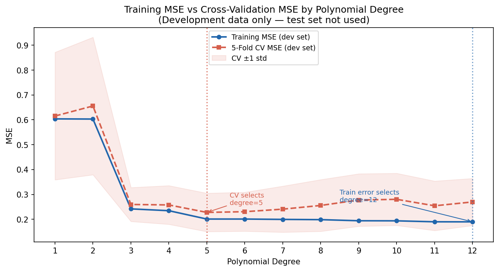
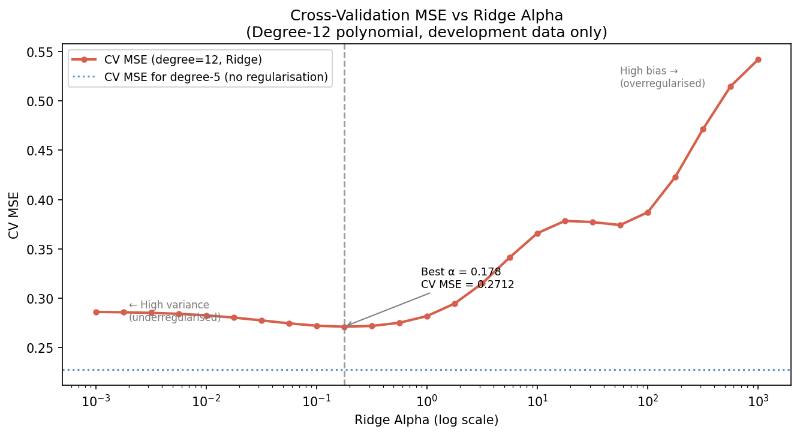
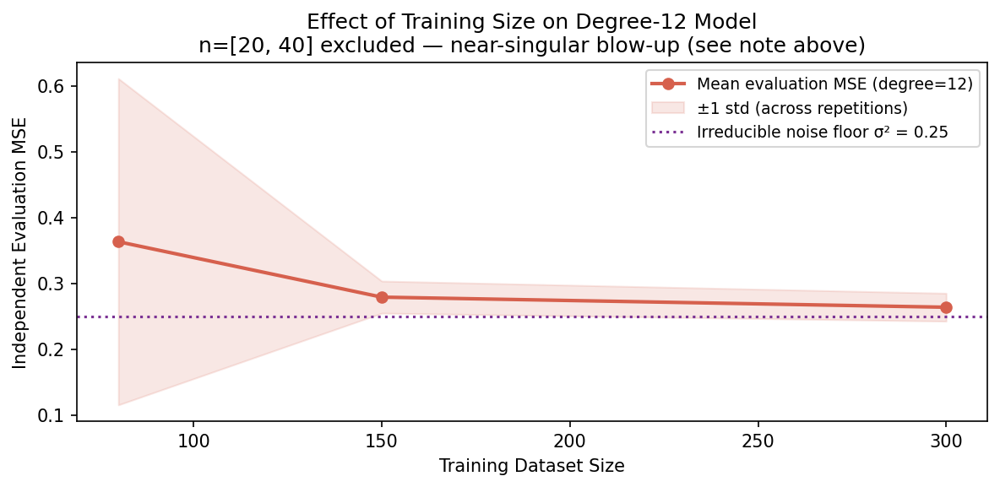
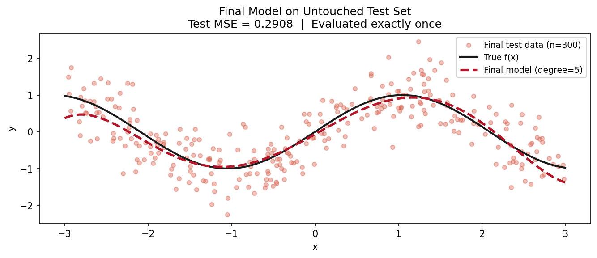

# Why Your Model Aces Training But Fails in Production: Understanding Bias, Variance, and the Trade-Off

**Master the framework that separates models that memorise from models that learn — with a real empirical decomposition in Python.**

---

You train a model. Training error: low. You deploy it. Production error: five times higher.

You add complexity. Training error drops further. Production error climbs.

You strip it back to a straight line. Training and production error finally match — but they are both too high to be useful.

This is not a data problem or a code bug. It is a structural property of learning from finite, noisy data. It has a name and a mathematical explanation: the bias-variance trade-off.

This article will give you both — the intuition to recognise what is happening, the mathematics to understand why, and the Python implementation to measure and correct it.

---

## The Problem a Simple Model Can't Solve

Suppose you are predicting a continuous quantity — house prices, energy consumption, sensor readings — from a single input feature. You generate some training data, fit a model, and check the training error. It is low. You feel confident.

Then you check performance on held-out data. The error is far higher.

The naive response is to try a more complex model. A degree-12 polynomial instead of a straight line. Training error drops to near zero. Held-out error is now worse than before.

What went wrong?

The straight line was **too rigid** to capture the real pattern — it was systematically wrong in the same way regardless of which training data you used. The high-degree polynomial was **too sensitive** — it memorised the noise in the training data and mistook it for signal. Neither model learned what you actually wanted.

These are the two failure modes. Everything else in this article is understanding why they happen, how to detect them, and how to find the right balance between them.

---

## Intuition: The Archer Analogy

Before the mathematics, consider an archer shooting at a target. You run the following experiment: draw many independent training datasets from the same population, train one model on each, and look at that model's prediction at a fixed point $x$.

The collection of predictions across all those models is like a set of arrows fired at the true value $f(x)$.

- **Bias** is how far the average arrow lands from the bullseye — the systematic error.
- **Variance** is how spread out the arrows are across shots — the sensitivity to which training dataset was used.


*Figure 1: The four combinations of bias and variance. A useful model needs low bias and low variance. The trade-off is that reducing one often increases the other. This is an intuition-building analogy — not a mathematical definition.*

A simple model like a straight line fires arrows that all land in the same wrong place — consistent, but consistently off. A complex model fires arrows that scatter widely — some close, many far. Neither is what you want.

What you want is arrows clustered tightly around the bullseye. But the trade-off is real: the tools that pull the arrows toward the center also tend to spread them out, and the tools that cluster them tend to move the cluster away from the center.

---

## What Bias and Variance Actually Are

The analogy is useful. The mathematics is precise.

Let:
- $f(x)$ — the true data-generating function (unknown in practice; known in our simulation)
- $\mathcal{D}$ — a training dataset of $n$ samples drawn from the same population
- $\hat{f}_{\mathcal{D}}(x)$ — the prediction of a model trained on $\mathcal{D}$, evaluated at $x$
- $$\mathbb{E}_{\mathcal{D}}[\hat{f}_{\mathcal{D}}(x)]$$ — the expected prediction at $x$, averaged over all possible training datasets of size $n$

**Bias** at $x$:

$$\text{Bias}[\hat{f}(x)] = \mathbb{E}_{\mathcal{D}}[\hat{f}_{\mathcal{D}}(x)] - f(x)$$

This is how far the average prediction is from the truth. A model with high bias makes the same kind of error regardless of which training data it saw.

**Variance** at $x$:

$$\text{Var}[\hat{f}(x)] = \mathbb{E}_{\mathcal{D}}\left[\left(\hat{f}_{\mathcal{D}}(x) - \mathbb{E}_{\mathcal{D}}[\hat{f}_{\mathcal{D}}(x)]\right)^2\right]$$

This is how much the prediction fluctuates when the training data changes. A model with high variance is highly sensitive to which particular samples it was trained on.

The expectation $\mathbb{E}_{\mathcal{D}}[\cdot]$ is over all possible training datasets of size $n$ from the same data-generating process. In our simulation, we approximate this by generating $M = 200$ independent training datasets.

---

## The Decomposition

For an observation $y = f(x) + \varepsilon$ where $\varepsilon \sim \mathcal{N}(0, \sigma^2)$ is irreducible noise, the expected squared prediction error decomposes exactly as:

$$\mathbb{E}\left[(y - \hat{f}_{\mathcal{D}}(x))^2\right] = \underbrace{\left(\text{Bias}[\hat{f}(x)]\right)^2}_{\text{Systematic error}} + \underbrace{\text{Var}[\hat{f}(x)]}_{\text{Sensitivity to training data}} + \underbrace{\sigma^2}_{\text{Irreducible noise}}$$

This is the bias-variance decomposition of mean squared error. Three things follow immediately:

1. **Bias² and Variance are both non-negative** — you cannot get expected error below $\sigma^2$ no matter how good the model is.
2. **Only Bias² and Variance depend on the model** — $\sigma^2$ is a property of the problem, fixed by how much inherent noise is in the target variable.
3. **The minimum of Bias² + Variance is the goal** — this is not necessarily where Bias² = Variance. The optimal trade-off depends on how quickly each component changes with model complexity.

A small numerical example. Suppose at some point $x$, the true value is $f(x) = 1.0$, and across 1,000 training experiments a model produces predictions with mean 1.4 and standard deviation 0.3. The irreducible noise is $\sigma^2 = 0.1$. Then:

- Bias = 1.4 − 1.0 = 0.4, so Bias² = 0.16
- Variance = 0.3² = 0.09
- Expected Error = 0.16 + 0.09 + 0.10 = 0.35

No amount of additional training samples will push the expected error below 0.10. Reducing Bias² requires a more flexible model; reducing Variance requires a simpler one or more data. These are different levers, and they usually pull in opposite directions.

---

## The Running Example: A Known True Function

To make all of this concrete and to measure it empirically, we use synthetic data where the true function is known:

$$f(x) = \sin(1.5x), \quad x \sim \text{Uniform}[-3, 3]$$
$$y = f(x) + \varepsilon, \quad \varepsilon \sim \mathcal{N}(0, 0.25)$$

The noise standard deviation is $\sigma = 0.5$, giving irreducible noise $\sigma^2 = 0.25$.

Using a known true function is a deliberate choice: it lets us compute exact Bias² and Variance against $f(x)$, rather than estimating them from data. This is impossible with real data — and is precisely why the empirical decomposition is a useful teaching tool.


*Figure 2: The synthetic development dataset (80 points). The gap between any point and the curve is noise — irreducible regardless of the model.*

We generate two datasets:

- **Development dataset** (80 samples, seed=42): used for all model selection via cross-validation.
- **Final test set** (300 samples, seed=999): generated independently, locked away until all model-selection decisions are complete, evaluated exactly once.

---

## Polynomial Degree as the Complexity Dial

We fit polynomial regression models of increasing degree to the development data:

$$\hat{f}_d(x) = w_0 + w_1 x + w_2 x^2 + \cdots + w_d x^d$$

Degree acts as a direct complexity dial. Low degree = rigid = high bias. High degree = flexible = high variance.

```python
from sklearn.pipeline import make_pipeline
from sklearn.preprocessing import PolynomialFeatures
from sklearn.linear_model import LinearRegression

def make_poly_pipeline(degree, ridge_alpha=0.0):
    poly = PolynomialFeatures(degree=degree, include_bias=False)
    if ridge_alpha > 0:
        from sklearn.linear_model import Ridge
        return make_pipeline(poly, Ridge(alpha=ridge_alpha))
    return make_pipeline(poly, LinearRegression())
```

Fitting at three complexity levels makes the failure modes visible:


*Figure 3: Polynomial fits at three complexity levels. Left: degree 1 (training MSE = 0.6037) — too rigid, misses the curve entirely. Centre: degree 4 (training MSE = 0.2345) — tracks the true function well. Right: degree 12 (training MSE = 0.1897) — passes through training points but wildly oscillates between them.*

Training MSE decreased monotonically from degree 1 to degree 12: 0.6037 → 0.2345 → 0.1897. This is not surprising. A sufficiently complex model can pass through every training point. But that is precisely the problem — it has memorised the noise, not the function.

---

## Seeing Variance in Action

To make variance tangible before quantifying it, generate 50 independent training datasets from the same DGP and fit a degree-1 and a degree-12 model on each. Plot all 50 fitted curves simultaneously.


*Figure 4: Prediction variability across 50 independent training datasets. Degree 1 (left): all fits are similar — consistently biased, but stable. Degree 12 (right): each training set produces a dramatically different model — this is high variance. This is an intuitive demonstration of prediction variability, not the numerical decomposition.*

The degree-1 fits are clustered tightly — they all make the same systematic error. The degree-12 fits scatter wildly — each training dataset pulls the model in a different direction. The true function (black line) is buried in the chaos.

This visual is the intuition. The numerical decomposition comes next.

---

## Empirical Bias-Variance Decomposition

With a known true function, we can compute Bias² and Variance as actual numbers. The procedure:

1. Fix an evaluation grid of 300 points across $[-3, 3]$.
2. For each polynomial degree being compared, generate $M = 200$ independent training datasets, each of size 80, from the same DGP.
3. Train one model per dataset. Predict on the fixed evaluation grid. Store all 200 prediction vectors.
4. Compute the mean prediction at each grid point. Compute integrated Bias² and Variance.
5. Add the known $\sigma^2 = 0.25$ to get the Expected Error estimate.

```python
predictions = np.empty((M_BOOTSTRAP, N_EVAL))

for m in range(M_BOOTSTRAP):
    rng = np.random.default_rng(seed=m)
    X_train_m = rng.uniform(-3, 3, 80).reshape(-1, 1)
    y_train_m = np.sin(1.5 * X_train_m.ravel()) + rng.normal(0, 0.5, 80)
    model_m = make_poly_pipeline(degree=d)
    model_m.fit(X_train_m, y_train_m)
    predictions[m, :] = model_m.predict(X_eval)

mean_pred    = predictions.mean(axis=0)
squared_bias = np.mean((mean_pred - f_eval) ** 2)
variance     = np.mean(predictions.var(axis=0))
noise        = 0.5 ** 2  # sigma^2, known from DGP
expected_err = squared_bias + variance + noise
```

The results across degrees 1 through 12:

| Degree | Bias² | Variance | Noise (σ²) | Expected Error |
|---|---|---|---|---|
| 1 | 0.4787 | 0.0179 | 0.2500 | 0.7466 |
| 2 | 0.4788 | 0.0313 | 0.2500 | 0.7601 |
| 3 | 0.0698 | 0.0179 | 0.2500 | 0.3378 |
| 4 | 0.0703 | 0.0274 | 0.2500 | 0.3477 |
| **5** | **0.0017** | **0.0219** | **0.2500** | **0.2735** |
| 6 | 0.0017 | 0.0303 | 0.2500 | 0.2820 |
| 8 | 0.0002 | 0.0610 | 0.2500 | 0.3112 |
| 10 | 0.0008 | 0.1410 | 0.2500 | 0.3918 |
| 12 | 0.0123 | 0.4568 | 0.2500 | 0.7191 |

*These are empirical estimates from M=200 repeated training experiments. They approximate the theoretical quantities under the stated data-generating process.*


*Figure 5: Empirical bias-variance decomposition across model complexity. Bias² (red-orange) decreases as degree grows. Variance (green) increases sharply at high degrees. Expected Error (orange) reaches its minimum at degree 5 — the empirically optimal complexity for this DGP. The minimum is annotated; note it does not coincide with where Bias² = Variance.*

The decomposition confirms the theory:

- At degree 1–2, Bias² dominates (0.48). The model cannot capture the sine curve's oscillations. Variance is negligible (0.02) — the model barely changes across training sets.
- At degree 5, Bias² has dropped to 0.0017 — nearly zero. Variance is 0.0219. Expected Error is at its minimum: 0.2735, only 0.0235 above the irreducible floor of 0.25.
- At degree 12, Bias² has risen again slightly (0.0123), but Variance has exploded to 0.4568 — 26 times what it was at degree 5. Expected Error has more than doubled back to 0.7191.

**The minimum Expected Error occurs at degree 5 — not where Bias² = Variance.** At degree 5, Bias² (0.0017) is far smaller than Variance (0.0219). The minimum is determined by the specific rates at which each component changes with complexity, not by their equality.

---

## Model Selection: Cross-Validation, Not Training Error

Knowing that degree 5 minimises expected error is only possible here because we know $f(x)$. In any real problem, you do not.

The practical tool is cross-validation on development data.

**The methodology:**

1. Use the development dataset for all model selection.
2. For each candidate degree, compute K-fold CV MSE.
3. Select the degree with the lowest CV MSE.
4. Never touch the final test set during this process.

```python
from sklearn.model_selection import KFold, cross_val_score

kf = KFold(n_splits=5, shuffle=True, random_state=42)

cv_mse = {}
train_mse = {}

for d in range(1, 13):
    pipe = make_poly_pipeline(degree=d)
    scores = cross_val_score(pipe, X_dev, y_dev,
                             cv=kf, scoring="neg_mean_squared_error")
    cv_mse[d]    = -scores.mean()
    pipe.fit(X_dev, y_dev)
    train_mse[d] = mean_squared_error(y_dev, pipe.predict(X_dev))
```

Results from the executed experiment:

| Degree | Training MSE | CV MSE |
|---|---|---|
| 1 | 0.6037 | 0.6152 |
| 3 | 0.2418 | 0.2596 |
| **5** | **0.2010** | **0.2277** ← CV best |
| 7 | 0.1995 | 0.2407 |
| 10 | 0.1938 | 0.2803 |
| 12 | 0.1897 | 0.2698 |

*Table shows selected degrees for readability. The complete degree 1–12 sweep is in the companion notebook (Section 9).*

Training MSE decreased monotonically. CV MSE found a minimum at degree 5 — the same degree identified by the empirical decomposition.


*Figure 6: Training MSE (blue) and 5-fold CV MSE (red) by polynomial degree. Training error always favours the most complex model — it selected degree 12. CV error reveals the generalisation optimum — it selected degree 5. Development data only; the test set was not used.*

**Cross-validation used the training folds to fit the model and the validation folds to estimate generalisation error.** The mean across all 5 splits is the cross-validation estimate — the right quantity to minimise for model selection.

---

## Regularisation: Reining In a Complex Model

An alternative to reducing degree is adding an L2 penalty — Ridge regression. This allows the model to have 12 polynomial features while constraining the coefficient magnitudes:

$$\hat{w} = \arg\min_w \left\|y - Xw\right\|^2 + \alpha \left\|w\right\|^2$$

A larger $\alpha$ shrinks coefficients more aggressively, increasing bias but reducing variance. A smaller $\alpha$ relaxes the constraint, recovering the unregularised behaviour.

We select $\alpha$ via CV on the development data across 25 log-spaced values from $10^{-3}$ to $10^3$:

```python
from sklearn.linear_model import Ridge
import numpy as np

ridge_alphas = np.logspace(-3, 3, 25)
ridge_cv_mse = {}

for alpha in ridge_alphas:
    pipe = make_poly_pipeline(degree=12, ridge_alpha=alpha)
    scores = cross_val_score(pipe, X_dev, y_dev,
                             cv=kf, scoring="neg_mean_squared_error")
    ridge_cv_mse[alpha] = -scores.mean()

best_alpha = min(ridge_cv_mse, key=ridge_cv_mse.get)
```

The selected Ridge alpha was **0.1778**, achieving a CV MSE of **0.2712** on the degree-12 model.


*Figure 7: Cross-validation MSE vs Ridge alpha for the degree-12 polynomial. Small alpha (left) → high variance — the model is effectively unregularised. Large alpha (right) → high bias — coefficients are over-shrunk. The minimum at α=0.178 achieves CV MSE 0.2712 — marginally worse than the unregularised degree-12 baseline (0.2698) and substantially above the degree-5 optimum (0.2277). In this setting, choosing the right complexity outperformed regularising the wrong one.*

The best Ridge alpha (0.1778) produced CV MSE 0.2712 on the degree-12 model. The unregularised degree-12 CV MSE was 0.2698 — nearly identical. Ridge moved CV MSE by only +0.0014 and left a gap of 0.0435 above the degree-5 optimum (0.2277). The CV scores are similar because 5-fold CV on held-out folds already reveals the high-variance model's poor generalisation — CV measures the variance, it does not eliminate it. What Ridge actually does is constrain the *coefficient magnitudes*, producing a smoother fitted curve. That benefit shows up most clearly on larger test sets or repeated evaluation, not in CV estimates on 80 samples.

Both approaches fall well short of the degree-5 CV MSE of 0.2277. The clearest lesson: **choosing the right complexity is more effective than regularising the wrong one**, though regularisation remains a useful correction when you cannot reduce complexity directly.

This illustrates the practical relationship: reducing complexity (degree selection) and adding regularisation are two routes to managing the bias-variance trade-off. Cross-validation guides both.

---

## Does More Data Help?

For a high-variance model, more training data reduces the model's sensitivity to any particular sample. We tested this for the degree-12 model by running 50 independent repetitions at each training size from 20 to 300 samples.

**An important finding at very small training sizes:** When n=20 or n=40, fitting a degree-12 polynomial (which has 12 free parameters) on a dataset with fewer effective degrees of freedom produces near-singular design matrices. The result is numerical blow-up — mean evaluation MSE in the tens of thousands. This is the mathematical consequence of fitting more parameters than you have data to constrain them.


*Figure 8: Effect of training size on degree-12 generalisation (50 independent repetitions per size). At n=20 and n=40, numerical blow-up occurs — excluded for readability. At n=80 and above, more data steadily reduces MSE, but the irreducible noise floor (σ²=0.25) sets a hard lower limit.*

At n=80 (our development dataset size), mean evaluation MSE was 0.3633. At n=300, it dropped to 0.2638 — close to the 0.25 floor. The standard deviation also narrowed dramatically, from 0.2479 at n=80 to 0.0212 at n=300.

More data reduces variance. It cannot reduce bias or irreducible noise. And for models with many more parameters than training points, even "more data" is not enough — the model must be regularised first.

---

## The Final Test: One Evaluation on Held-Out Data

After all model selection was complete — degree selected by CV, no further tuning — the final degree-5 model was retrained on the full development dataset (80 samples) and evaluated exactly once on the 300-sample test set.

```
Final test MSE (untouched test set): 0.2908
CV estimate (dev data):              0.2277
Irreducible noise floor σ²:          0.2500
```


*Figure 9: Final degree-5 model evaluated on the untouched test set (300 points, one evaluation). Test MSE = 0.2908, somewhat above the CV estimate of 0.2277. The fitted curve closely tracks the true function across the full domain.*

The test MSE (0.2908) is somewhat above the CV estimate (0.2277). With only 80 development samples and 5 folds, the CV standard deviation across folds was 0.0773 — placing the test MSE well within normal sampling variability rather than indicating a systematic effect. The test result is the honest estimate. It is above the irreducible noise floor (0.25), as it must be.

**The test set has been used once. We do not adjust the model based on this result.**

---

## Two Failure Modes to Know

### Failure 1: Selecting Complexity by Training Error

From the executed experiment: training error always selected degree 12, with training MSE 0.1897. CV selected degree 5 with CV MSE 0.2277. The degree-12 model's actual CV MSE was 0.2698 — worse than degree 5.

Training error measures memorisation, not generalisation. A polynomial of sufficiently high degree can interpolate any finite dataset and achieve near-zero training error while predicting poorly on any new point. Using training error for model selection will systematically and silently overfit.

### Failure 2: Repeated Test-Set Use

Suppose instead of CV you had used the test set to select the polynomial degree: fit each candidate, evaluate on the test set, pick the winner. In our illustrative comparison, CV selected **degree 5** (CV MSE 0.2277). Test-set selection chose **degree 7** (reported test MSE 0.2902), which has a higher CV-estimated error of 0.2407. The two methods disagree — test-set reuse changed the selected configuration.

This single run illustrates contamination but cannot estimate the magnitude of the bias. Degree 7 has worse CV-estimated performance on average, but one run cannot establish it as a worse true generaliser — test-set noise influenced which degree appeared optimal on this particular sample. The minimum of $K$ test-set evaluations is structurally an optimistically biased estimator of true generalisation error: each evaluation uses test data to make a decision, so that information leaks into the selection process. Quantifying the selection-induced optimism requires repeated selection/evaluation experiments — a single run only illustrates that the selected configuration can change.

The correct workflow is:

```
development data
  → cross-validation (training folds → validation folds)
  → select complexity and regularisation
  → retrain on all development data
  → evaluate ONCE on the final test set
  → report and stop
```

The test set has one job: provide an unbiased estimate of generalisation performance after all decisions are made. Using it for anything else compromises that estimate.

---

## When to Worry About This

The bias-variance trade-off applies to every supervised learning model. The specific vocabulary changes — tree depth instead of polynomial degree, dropout rate instead of Ridge alpha — but the framework is the same.

**Signs of high bias (underfitting):**
- Both training and CV error are high.
- Adding more training data does not help.
- A more complex model improves CV performance.

**Signs of high variance (overfitting):**
- Training error is low; CV error is significantly higher.
- Performance is inconsistent across CV folds (high CV std).
- A simpler model or regularisation improves CV performance.

**Corrective actions:**

| Problem | Corrective action |
|---|---|
| High bias | Increase model complexity, add features, try a more flexible model class |
| High variance | Add regularisation, collect more data, reduce complexity |
| Both high | The feature representation may be inadequate, or the problem may be very noisy |

---

## Limitations and Trade-offs

**The decomposition assumes the test data comes from the same DGP as the training data.** If the distribution shifts — different customer behaviour, different sensor calibration, a different time period — the trade-off still exists but the optimal complexity may shift. Cross-validation on historical data cannot detect future distribution shift.

**Bias and variance are defined relative to a model class, not a single model.** When we say "a degree-5 polynomial has low bias for this DGP," we mean: among all degree-5 polynomials, the one that minimises expected error is very close to the true function. A degree-5 polynomial on a completely different DGP might have high bias.

**More data reduces variance, but requires the model to generalise.** As our experiment showed, a degree-12 polynomial with only 20 training points does not just overfit — it produces numerically degenerate predictions. Adding regularisation is necessary before adding data helps.

**Cross-validation itself has variance.** With only 80 development samples and 5 folds, the CV estimate is noisy. Our CV MSE for degree 5 was 0.2277 with a standard deviation of 0.0773 across folds. The "best" degree by CV could easily be 4 or 6 in a different random split. This is why the final test result (0.2908) is the more reliable estimate.

---

## Related Concepts

| Technique | How it relates to bias-variance |
|---|---|
| Regularisation (Ridge, Lasso, dropout) | Reduces variance by constraining model flexibility; may increase bias |
| Ensemble methods (bagging, random forests) | Reduce variance by averaging multiple high-variance models |
| Boosting | Reduces bias sequentially; risks increasing variance if run too long |
| Early stopping (neural networks) | Stops training before the model overfits; implicit complexity control |
| Cross-validation | Estimates generalisation error for model selection without touching the test set |

---

## Knowledge Check

**1.** A model achieves 0.02 training MSE and 0.41 CV MSE. Which failure mode does this suggest, and what would you try first?

*Answer: High variance — the model is overfitting. Try reducing complexity, adding regularisation, or collecting more training data.*

**2.** You run 5-fold CV and select the best model. You then evaluate it on the test set and find a significantly higher error than your CV estimate predicted. You re-run CV on a different fold split and get a similar result, but your test performance is still worse. What is most likely happening?

*Answer: The test data likely comes from a different distribution than the development data (distribution shift). CV cannot detect this. Investigate whether the test set was collected at a different time, under different conditions, or from a different population.*

**3.** Why does the minimum of Expected Error not necessarily occur where Bias² = Variance?

*Answer: Expected Error = Bias² + Variance + σ². The minimum occurs where the derivative of Bias² + Variance with respect to model complexity equals zero. This depends on how quickly each component changes with complexity — which is a property of the specific model class and DGP. There is no general rule requiring them to be equal at the optimum.*

**4.** You are choosing between two models. Model A has CV MSE = 0.31 ± 0.02. Model B has CV MSE = 0.29 ± 0.18. Which would you choose and why?

*Answer: Model A. Despite the slightly higher mean CV MSE, its standard deviation across folds is 0.02 — highly consistent. Model B's CV std of 0.18 suggests its performance is very sensitive to which samples appear in which fold — a sign of high variance. Model A is the more reliably generalising choice.*

---

## Summary

**What bias and variance are:** Bias is the systematic error — how far the average model prediction is from the truth. Variance is the sensitivity error — how much the prediction changes when the training data changes. Both are properties of the model class and the training data size, not of any single model instance.

**Why the trade-off exists:** The expected squared prediction error decomposes into Bias² + Variance + σ². Increasing model complexity reduces Bias² and increases Variance. The irreducible noise σ² sets a hard floor. The goal is to find the complexity where Bias² + Variance is minimised — not where they are equal.

**What the experiments showed:**
- Training MSE is a misleading model-selection criterion — it selected degree 12, the most complex model.
- CV MSE identified degree 5, matching the empirical decomposition's minimum Expected Error.
- The empirical decomposition at degree 5: Bias² = 0.0017, Variance = 0.0219, Expected Error = 0.2735 (σ² = 0.25 is the floor).
- Ridge on the degree-12 model selected alpha=0.1778 (CV MSE 0.2712) — marginally worse than the unregularised degree-12 baseline (0.2698) and well above the degree-5 optimum (0.2277). Choosing the right complexity was more effective than regularising the wrong one.
- More data helps — but not below the irreducible noise floor, and not without regularisation when parameters outnumber samples.

**The two failures to avoid:** Selecting by training error always overfits. Using the test set for selection produces optimistically biased estimates of generalisation performance.

**The right workflow:** Use development data and cross-validation for all model selection. Freeze the selected configuration. Evaluate on the test set exactly once. Report the result without adjustment.

> A model that memorises is useless on new data. A model that oversimplifies is useless everywhere. The goal is to find the complexity where the model generalises — and cross-validation is how you find it.

---

*The companion Jupyter Notebook (`notebooks/concept_walkthrough.ipynb`) contains the complete executable implementation of all experiments, the empirical bias-variance decomposition, all visualisations, failure case demonstrations, and exercises.*
